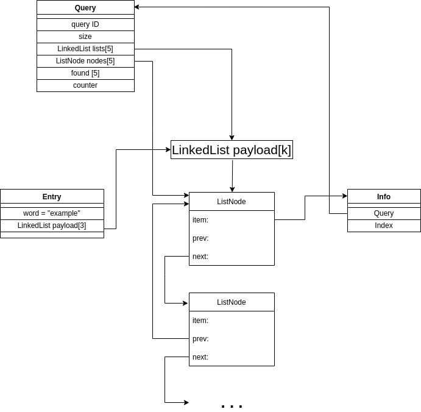

# Inverted Search Engine
[](https://github.com/AngelPn/Inverted-Search-Engine/actions)

## Authors
- sdi1800101 - Βάιος Λύτρας
- sdi1800141 - Αγγελική Παναγοπούλου
- sdi1800142 - Θεοδώρα Παντελιού

## Compile & Execute
* Mεταγλώττιση και εκτέλεση όλων των tests:
  ```
  $ make run
  ```
* Mεταγλώττιση και εκτέλεση όλων των tests με `valgrind`:
  ```
  $ make valgrind
  ```
* Mεταγλώττιση και εκτέλεση του κάθε test ξεχωριστά:
  ```
  $ make
  $ ./test_Entry
  $ ./test_LinkedList
  $ ./test_BKTree
  $ ./test_HammingTree
  $ ./test_Query
  $ ./test_Document
  ```
* Εκκαθάριση
  ```
  $ make clean
  ```
  
## Project Structure
* `include`

   Κοινόχρηστα include files που χρησιμοποιούνται από οποιοδήποτε πρόγραμμα ή module.
   
* `mylib`

  Παρέχει τις υλοποιήσεις των δομών δεδομένων: `LinkedList`, `BK Tree`, `Hamming Tree`, `Hash Table`, `Index`, `Entry`, `Query`, `Document`.

* `tests`

  Tests για τις υλοποιημένες δομές δεδομένων και συναρτήσεις του `mylib`. Οποιαδήποτε υλοποίηση οφείλει να περνάει το αντίστοιχο test.
  
## Implementation

### [Linked List](https://github.com/AngelPn/Inverted-Search-Engine/tree/main/mylib/LinkedList)
  Διπλή λίστα γενικού τύπου που συγκρατεί τα στοιχεία μέσω δείκτη και τα καταστρέφει με συνάρτηση καταστροφής που δίνεται κατά τη δημιουργία της λίστας. Συγκρατεί επιπλέον δείκτη στον τελευταίο κόμβο για υλοποίηση FIFO. 

### [Hash Table](https://github.com/AngelPn/Inverted-Search-Engine/tree/main/mylib/HashTable)
  Το hash table περιέχει τις βασικές συναρτήσεις που χρειάζονται όπως get, insert, remove, initialize και delete. Ο αριθμός των bucket αλλάζει ανάλογα με τον αριθμό των αντικειμένων που περιέχονται. Στην initialize μπορεί να δωθεί μία αρχική εκτίμηση για το μέγεθος του hash table, αλλά επειδή ο αριθμός των bucket είναι πάντα πολλαπλάσιο του 2, η εκτίμηση αυτή στρογγυλοποιείται στο επόμενο πολλαπλάσιο του 2. Κάθε φορά που το load factor γίνεται μεγαλύτερο από 1,7 τότε διπλασιάζεται το hash table και γίνονται rehash όλα τα κλειδιά και ανατίθενται στα κατάλληλα buckets. Έτσι διατηρείται καλή πολυπλοκότητα ανεξάρτητα του αριθμού των αντικειμένων.
  
### [BK Tree](https://github.com/AngelPn/Inverted-Search-Engine/tree/main/mylib/BKTree)

  ΒΚ δέντρο που τα παιδιά κάθε κόμβου είναι υλοποιημένα με ταξινομημένη λίστα. Ο δείκτης child δείχνει στο πρώτο παιδί του αντίστοιχου κόμβου και ο δείκτης next δείχνει στον επόμενο κόμβο - παιδί του γονέα.

  * [`create_BK_tree()`](https://github.com/AngelPn/Inverted-Search-Engine/blob/main/mylib/BKTree/BKTree.c#L23): Δημιουργεί ένα κενό BK tree. Στο δέντρο δίνεται δείκτης στη συνάρτηση που θα υπολογίζει την απόσταση, δηλαδη η EditDist/HammingDist.
  
  * [`insert_BK_tree()`](https://github.com/AngelPn/Inverted-Search-Engine/blob/main/mylib/BKTree/BKTree.c#L93): Εισάγει τη λέξη ως στοιχείο του δέντρου στη κατάλληλη θέση και επιστρέφει το στοιχείο.

  * [`lookup_BKtree()`](https://github.com/AngelPn/Inverted-Search-Engine/blob/main/mylib/BKTree/BKTree.c#L107-L140): Εκτελεί αναζήτηση στο ΒΚ-δέντρο λέξεις που ταιριάζουν με τη λέξη στο όρισμα `w` με βάση το `threshold` που δίνεται ως παράμετρος και την συνάρτηση απόστασης λέξεων που δόθηκε στην `create_BK_tree()`. Σε περίπτωση που μια λέξη-στοιχείο του δέντρου ταιριάζει, τότε καλεί την `update_payload()` για να ενημερώσει τις κατάλληλες δομές.
  Η αναζήτηση γίνεται με τον αλγόριθμο των τριών βημάτων: 
    1. Δημιούργησε μία λίστα υποψήφιων λέξεων-στοιχείων του δέντρου και πρόσθεσε τη ρίζα σε αυτή τη λίστα.
    2. Βγάλε μία υποψήφια λέξη από τη λίστα, υπολόγισε την απόστασή της 𝑑 από τη λέξη της ερώτησης και σύγκρινε την απόσταση με την ακτίνα. Αν είναι μικρότερη, κάλεσε την `update_payload()`.
    3. Κριτήριο επιλογής: πρόσθεσε στη λίστα υποψήφιων λέξεων όλα τα παιδιά του συγκεκριμένου κόμβου που έχουν απόσταση από τον γονέα στο διάστημα [𝑑 − 𝑛, 𝑑 + 𝑛].

  * [`print_BK_tree()`](https://github.com/AngelPn/Inverted-Search-Engine/blob/main/mylib/BKTree/BKTree.c#L151): Βοηθητική συνάρτηση που εκτυπώνει αναδρομικά ένα ΒΚ δέντρο από πάνω προς τα κάτω και από τα αριστερά προς τα δεξιά και μαζί με τις λέξεις τυπώνει και έναν αριθμό που είναι το   πόσα παιδία έχει ένας κόμβος. Αν αυτός ο αριθμός είναι πχ 1 τότε αυτό σημαίνει ότι η ακριβώς απο κάτω λέξη της εκτύπβσης είναι το παιδί της. Παράδειγμα:  
  hell-2  
  help-1  
  fell-0  
  fall-1  
  felt-0  
  Η hell έχει 2 παιδιά άρα η help είναι το 1ο παιδί της. Επειδή η help έχει 1 παιδί η fell δεν είναι το 2ο παιδί της hell αλλά το παιδί της help. H fall είναι το 2ο παιδί της hell και η felt το παιδί της.
    
  * [`destroy_BK_tree()`](https://github.com/AngelPn/Inverted-Search-Engine/blob/main/mylib/BKTree/BKTree.c#L183): Απελευθερώνει αναδρομικά όλη την μνήμη ενός δέντρου.

### [Hamming Tree](https://github.com/AngelPn/Inverted-Search-Engine/tree/main/mylib/HammingTree)
  * [`create_HammingTree()`](https://github.com/AngelPn/Inverted-Search-Engine/blob/main/mylib/HammingTree/HammingTree.c#L12-L18): Δημιουργεί ένα BK tree για κάθε μήκος λέξης στο διάστημα [4, 31]. Στο δέντρο δίνεται δείκτης στη συνάρτηση που θα υπολογίζει την απόσταση, δηλαδη η HammingDist.

  * [`insert_HammingTree()`](https://github.com/AngelPn/Inverted-Search-Engine/blob/main/mylib/HammingTree/HammingTree.c#L24)/[`lookup_HammingTree()`](https://github.com/AngelPn/Inverted-Search-Engine/blob/main/mylib/HammingTree/HammingTree.c#L29): Καλεί τις μεθόδους `insert_BK_tree()`/`lookup_BKtree()` για το ΒΚ-δέντρο που περιέχει λέξεις με το ίδιο μήκος με τη λέξη που δίνεται ως παράμετρος στη συνάρτηση.

  * [`destroy_HammingTree()`](https://github.com/AngelPn/Inverted-Search-Engine/blob/main/mylib/HammingTree/HammingTree.c#L43): Απελευθερώνει αναδρομικά όλη την μνήμη όλων των ΒΚ-δέντρων καλώντας την `destroy_BK_tree()`.

### [Entry](https://github.com/AngelPn/Inverted-Search-Engine/tree/main/mylib/Entry)
Αποτελεί τη δομή που εισάγεται ως στοιχείο στα ευρετήρια. Περιέχει τη λέξη και το [`payload`](https://github.com/AngelPn/Inverted-Search-Engine/blob/main/mylib/Entry/Entry.c#L12). Το `payload` ορίζεται ως ένας πίνακας μεγέθους 3 από λίστες με στοιχεία [`info`](https://github.com/AngelPn/Inverted-Search-Engine/blob/main/mylib/Entry/Entry.c#L18). Το index του πίνακα payload δείχνει το `match_dist`, για παράδειγμα `payload[2]` δίνει τη λίστα από `info` τα οποία περιέχουν queries με `match_dist = 3`. Τα ευρετήρια BK tree/Hamming tree θα έχουν λέξεις από queries με `match_dist = {1, 2, 3}`, ενώ το ευρετήριο ExactMatch θα έχει λέξεις από queries μόνο με `match_dist = {0}` και άρα χρησιμοποιείται μόνο το `payload[0]`. Η δομή `info` περιέχει δείκτη στο `Query` και το `index` της λέξης του `entry` στις λέξεις του `Query`, δηλαδή τη σειρά με την οποία η λέξη αυτη εμφανίζεται στις λέξεις του ερωτήματος. Έχουν δημιουργηθεί οι κατάλληλες δομές δημιουργίας και καταστροφής των δομών αυτών. Ενδιαφέρον παρουσιάζουν οι παρακάτω συναρτήσεις:
  * [`insert_info_payload()`](https://github.com/AngelPn/Inverted-Search-Engine/blob/main/mylib/Entry/Entry.c#L63-L73): Δημιουργεί τη δομή `info` και την εισάγει στο κατάλληλο `payload` του `entry`. Στη συνέχεια, καλεί την [`set_info_location()`](https://github.com/AngelPn/Inverted-Search-Engine/blob/main/mylib/Query/Query.c#L30) για να θέσει κατάλληλα τα πεδία `lists` και `nodes` του Query που αναλύονται παρακάτω.
  * [`update_payload()`](https://github.com/AngelPn/Inverted-Search-Engine/blob/main/mylib/Entry/Entry.c#L75-L94): Διατρέχει τα στοιχεία της λίστας `payload[threshold]`. Τα ερωτήματα που υπάρχουν σε αυτή τη λίστα, είναι υποψήφια ερωτήματα που ταιριάζουν κειμένου. Για κάθε ένα από αυτά, σημειώνουμε στο Query ότι βρέθηκε η συγκεκριμένη λέξη του `entry`, με κλήση της μεθόδου `found()` που αναλύεται παρακάτω. Αν η μέθοδος αυτή επιστρέψει `true`, τότε βρέθηκαν όλες οι λέξεις του ερωτήματος στο κείμενο, άρα το κείμενο απαντάει στο ερώτημα και προσθέτουμε το Query στη λίστα με τα `matched_queries`. Σε περίπτωση που το ερώτημα αυτό βρέθηκε υποψήφιο για πρώτη φορά, το εισάγουμε στη λίστα με τα `candidate_queries`. 

### [Query](https://github.com/AngelPn/Inverted-Search-Engine/tree/main/mylib/Query)
Αποτελεί τη δομή του ερωτήματος και περιέχει το `query ID`, το `size` που είναι το πλήθος των λέξεων που υπάρχουν στο ερώτημα και τα βοηθητικά πεδία:
  - `lists` και `nodes`: Συγκρατούν για κάθε λέξη του ερωτήματος, δείκτη στη λίστα `payload` του `entry` στο κατάλληλο ευρετήριο και δείκτη στον κόμβο της λίστας αυτής που έχει ως στοιχείο του το `info` που έχει ως στοιχείο του το συγκεκριμένο query. Οι δείκτες αυτοί υπάρχουν για γρήγορη αφαίρεση των ερωτημάτων από τη λίστα `payload`, σε περίπτωση εντολής `EndQuery`.
  - `found`: Αν κατά την αναζήτηση στα ευρετήρια, βρεθεί αυτή η λέξη του ερωτήματος, θέτει με `true` το πεδίο `found` με το συγκεκριμένο index της λέξης.
  - `counter`: Μετρητής των μοναδικών λέξεων του ερωτήματος που βρέθηκαν κατά τη διαδικασία της αναζήτησης στα ευρετήρια.

Έχουν δημιουργηθεί οι κατάλληλες δομές δημιουργίας και καταστροφής της δομής Query. Ενδιαφέρον παρουσιάζουν οι παρακάτων συναρτήσεις:
  * [`found()`](https://github.com/AngelPn/Inverted-Search-Engine/blob/main/mylib/Query/Query.c#L47): Θέτει με `true` το πεδίο `found` του Query για το συγκεκριμένο index που δίνεται ως παράμετρο στη συνάρτηση. Επιστρέφει `true` σε περίπτωση που όλες οι λέξεις του ερωτήματος έχουν βρεθεί κατά την αναζήτηση των ευρετηρίων. Σε περίπτωση που το βοηθητικό πεδίο `found` του Query μεταβάλλεται για πρώτη φορά, σημαίνει ότι το Query αυτό είναι υποψήφιο ερώτημα ενός κειμένου και σηματοδοτείται με τη μεταβλητή αλήθειας `found_first_time`.
  * [`reset_found()`](https://github.com/AngelPn/Inverted-Search-Engine/blob/main/mylib/Query/Query.c#L68): Θέτει τις τιμές του πεδίου `found` του Query με `false`. Καλείται μετά από κάθε αναζήτηση μιας λέξης στα ευρετήρια και σε περίπτωση που το Query από ήταν υποψήφιο.
  * [`end_query()`](https://github.com/AngelPn/Inverted-Search-Engine/blob/main/mylib/Query/Query.c#L74): Για κάθε λέξη του Query, διαγράφει τον κόμβο `info` από τη λίστα `payload` των στοιχείων `entry` που υπάρχουν στα ευρετήρια.

### [Document](https://github.com/AngelPn/Inverted-Search-Engine/tree/main/mylib/Document)
Η δομή document συγκρατά το `doc_ID`, το deduplicated `doc_str`, ένα hashtable που χρησιμοποιείται για να κάνει το deduplication κρατώντας κάθε λέξη του κειμένου μία φορά, μία λίστα `candidate_queries` με τα υποψήφια queries κατά την εκτέλεση της MatchDocument και μία λίστα `matched_queries` που είναι τα ερωτήματα που ταιριάζουν με το κείμενο και χρησιμοποιείται στην `get_next_avail_result()`. Ενδιαφέρον παρουσιάζουν οι ακόλουθες συναρτήσεις:
  * [`deduplicate_doc_str()`](https://github.com/AngelPn/Inverted-Search-Engine/blob/main/mylib/Document/Document.c#L32): Η deduplicate την πρώτη φορά που συναντάει μία καινούρια λέξη του document την προσθέτει μέσα σε ένα hashtable. Αν κάποια λέξη υπάρχει ήδη, δεν την προσθέτει. Κάθε φορά που προστίθεται μία λέξη στο hashtable, προστίθεται και στο `ded_doc_str` που είναι το ίδιο κείμενο χωρίς διπλότυπες λέξεις.
  * [`reset_candidate_queries()`](https://github.com/AngelPn/Inverted-Search-Engine/blob/main/mylib/Document/Document.c#L66): Για τα υποψήφια ερωτήματα, καλείται η `reset_found()`.
  * [`get_next_avail_result()`](https://github.com/AngelPn/Inverted-Search-Engine/blob/main/mylib/Document/Document.c#L79): Αυτή η συνάρτηση μετατρέπει την λίστα των `matched_queries` σε πίνακα ακεραίων που περιέχει τα id των queries του αποτελέσματος, τα ταξινομεί και τα αποθηκεύει στον δείκτη αποτελέσματος που δώθηκε στα ορίσματα.

### [Index](https://github.com/AngelPn/Inverted-Search-Engine/tree/main/mylib/Index)
Το Index είναι μία super δομή που περιέχει όλες τις υπόλοιπες απαραίτητες δομές για το project. Περιέχει ένα hamming_tree για τα queries της hamming distance, ένα BK_tree για τα queries της edit distance, ένα Hashtable για τα queries της exact_match, μία λίστα δομών Documents που κρατάει τα αποτελέσματα για κάθε document και ένα hashtable δομών Query το οποίο συγκρατά τις απαραίτητες πληροφορίες για τα query του αρχείου.
  * [`insert_index()`](https://github.com/AngelPn/Inverted-Search-Engine/blob/main/mylib/Index/Index.c#L37): Ανάλογα το `match_dist`, προσθέτει τη λέξη `token` στο κατάλληλο ευρετήριο ενημερώνοντας το `payload`, με κλήση της συνάρτησης `insert_info_payload()`.
  * [`lookup_index()`](https://github.com/AngelPn/Inverted-Search-Engine/blob/main/mylib/Index/Index.c#L50): Αναζητεί τη λέξη `token` στα ευρετήρια και ενημερώνει ότι η λέξη αυτή βρέθηκε με κλήση της `update_payload()`.

### [Job Scheduler](https://github.com/AngelPn/Inverted-Search-Engine/tree/match-document-parallel/mylib/JobScheduler)
Η δομή JobScheduler αποθηκεύει σε μια ουρά όλα τα jobs που πρόκειται να εκτελεστούν από τα threads, διαχειρίζεται την εκτέλεσή τους, διατηρείται σε όλη τη διάρκεια εκτέλεσης 
του προγράμματος και καταστρέφεται στο τέλος. Τα πεδία που περιέχει είναι:
    - `execution_threads`: Ο αριθμός των threads.
    - `LinkedList jobs`: Η ουρά FIFO που συγκρατεί τις διεργασίες προς εκτέλεση.
    - `pthread_t* tids`: Τα id των threads.
    - `pthread_mutex_t job_mtx`: Mutex για τα jobs.
    - `pthread_cond_t nonempty`, `pthread_cond_t empty`: Condition variables που συμβολίζουν αν η ουρά είναι κενή ή όχι.
    - `int job_counter`: Το πλήθος των στοιχείων που υπάρχουν στην ουρά jobs.
    - `bool quit`: Βοηθητική μεταβλητή για τον τερματισμό των threads.

Ο Job Scheduler περιέχει τις παρακάτω λειτουργίες:
  * [`submit_job()`](https://github.com/AngelPn/Inverted-Search-Engine/blob/match-document-parallel/mylib/JobScheduler/JobScheduler.c#L63): Θέτει ένα job στην ουρά και αυξάνει τον μετρητή στοιχείων της ουράς.
  * [`wait_all_jobs_finish()`](https://github.com/AngelPn/Inverted-Search-Engine/blob/match-document-parallel/mylib/JobScheduler/JobScheduler.c#L80): Περιμένει να εκτελεστούν όλα τα jobs της ουράς.
  * [`thread_code()`](https://github.com/AngelPn/Inverted-Search-Engine/blob/match-document-parallel/mylib/JobScheduler/JobScheduler.c#L30): Η ρουτίνα που θα εκτελέσει ένα νέο νήμα όταν δημιουργηθεί. Αρχικά, περιμένει να γίνει submit ένα job στην ουρά. Στη συνέχεια, εξάγει το job από την ουρά και το εκτελεί, μειώνοντας τον μετρητή στοιχείων της ουράς.

### [Job](https://github.com/AngelPn/Inverted-Search-Engine/tree/main/mylib/Job)
Η δομή που αντιπροσωπεύει μία εργασία προς εκτέλεση των threads. Περιέχει τις παραμέτρους της συνάρτησης προς εκτέλεσης καθώς και τον τύπο του job. Οι εργασίες που αναλαμβάνουν τα νήματα είναι οι συναρτήσεις match document και της εισαγωγής νέων στοιχείων σε διαφορετικές δομές (start query). Γι' αυτό, το [`job_type`](https://github.com/AngelPn/Inverted-Search-Engine/blob/match-document-parallel/mylib/Job/Job.h#L6) περιλαμβάνει έναν τύπο εργασίας. 

Το Job περιλαμβάνει συναρτήσεις δημιουργίας/καταστροφής και τη λειτουργία εκτέλεσης εργασίας:
  * [`run()`](https://github.com/AngelPn/Inverted-Search-Engine/blob/match-document-parallel/mylib/Job/Job.c#L21): Kαλεί την συνάρτηση `MatchDocument_job()`, περνώντας τις παραμέτρους, καθώς έχουμε έναν τύπο job.

### [Core](https://github.com/AngelPn/Inverted-Search-Engine/blob/main/ref_impl/core.c)
Οι βασικές συναρτήσεις και οι EditDist, HammingDist περιέχουν αναλυτικά σχόλια στον κώδικα.

### Σύνδεση των δομών κάθε κόμβου λέξης


## [Tests](https://github.com/AngelPn/Inverted-Search-Engine/tree/main/tests)
Τα tests υλοποιήθηκαν με την χρήση του εργαλείου [acutest](https://github.com/mity/acutest). Γίνονται tests στις βασικές συναρτήσεις των δομών δεδομένων που περιγράφηκαν παραπάνω. Η διαπίστωση για την απελευθέρωση της μνήμης μπορεί να γίνει μέσω valgrind, όπως αναφέρεται στις εντολές μεταγλώττισης και εκτέλεσης πιο πάνω. Μπορείτε να δείτε τα αποτέλεσματα των τεστ στo [Github Actions](https://github.com/AngelPn/Inverted-Search-Engine/actions).
